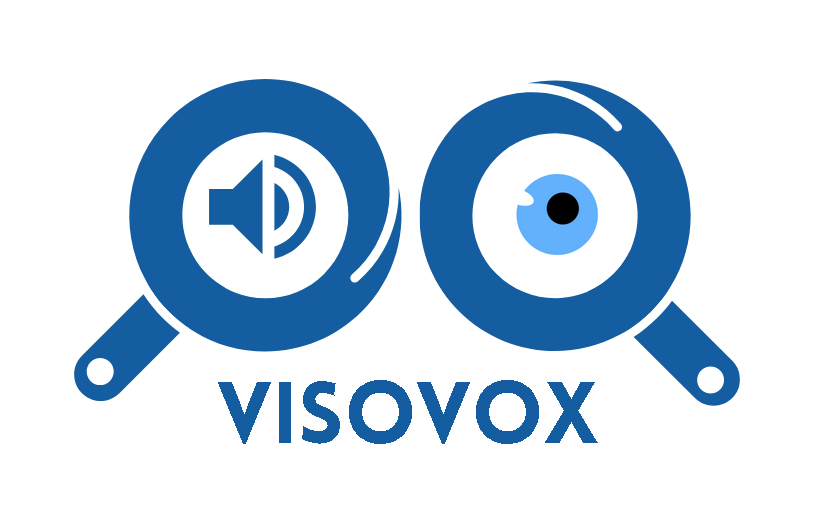

<p align="center">
  
</p>

<h1 align="center">🎙️🧠 VisoVox AI — Visual Assistant for Accessibility</h1>

<p align="center">
  <b>Empowering the visually impaired with intelligent image captioning and speech output</b>
</p>

<p align="center">
  
  
  
  
</p>

VisoVox AI is a powerful **AI-driven visual assistant** that can generate **and convert image captions** to **speech**. It utilizes the **BLIP (Bootstrapped Language-Image Pretraining) model** to generate captions for uploaded or captured images and converts the generated text into speech using **gTTS (Google Text-to-Speech)**.

## 🚀 Features

✅ **Image Captioning:** Automatically generate meaningful image descriptions using the BLIP model. ✅ **Text-to-Speech:** Converts captions into speech and plays the audio.
✅ **Upload or Capture:** Users can **upload an image** or **use their camera** to capture one in real time. ✅ **Interactive Interface:** Built with **Gradio** for a simple and user-friendly experience.

## 🛠️ Installation

Ensure you have **Python 3.7+** installed. Then, install the required dependencies:

```bash
pip install torch transformers streamlit gtts
```

## 🚀 Usage

Run the application using the following command:

```bash
streamlit run visovox_inteface.py
```

This will launch a **Gradio interface** where you can upload or capture an image and get an AI-generated caption with speech output.

## 📌 How It Works

1. **Upload an image** or **capture one using your camera**.
2. **AI generates a caption** using the **BLIP model**.
3. **Caption is converted to speech** using **gTTS**.
4. The **image, caption, and an audio player** are displayed.

## 🖥️ Deployment (Optional)

If you want to **share your app online**, use:

```python
iface.launch(share=True)
```

This will generate a public link where others can use the app.

## 🔧 Troubleshooting

- **Issue:** `Torch not installed`
  - **Solution:** Run `pip install torch`
- **Issue:** `gTTS not generating audio`
  - **Solution:** Ensure you have an active internet connection.
- **Issue:** `Camera not working in Gradio`
  - **Solution:** Make sure your browser has camera permissions enabled.


## 🤝 Let's Collaborate!
💡 VisoVox is a growing project, and we’re open to contributors who care about AI for accessibility.
Feel free to open an issue or submit a pull request!

📬 Reach out for collaborations or feature ideas!

## 📜 License

This project is **open-source** and available under the **MIT License**.

---

### **👨‍💻 Author:**

Ayobankole (Grok Member) - 2025
